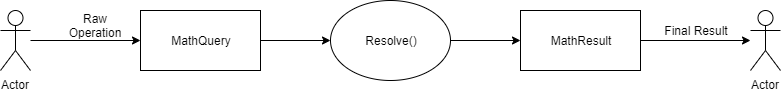

<div style="background:#000;text-align:center;">
    
</div>

# lib4math | v2.2
lib4math implements math functions to resolve problems in Javascript.
## Features
- Respect the PEMDAS hierarchy
- Support operations +-*/^
- Results in LaTeX
- Support Algebra Operations
- Step By Step solutions

## Soon Features
- Constants
- Trigonometric functions
- Solve equations systems
- Solve matrix
- Differential and Integral Calculus

## How to start
- Build the project or [download one of our releases](https://github.com/AlexHoyos/Lib4Math/releases)
- Include the lib4math.js file in your project
    ```
    <script src="path/to/lib4math.js"></script>
    ```
- You will have access to library with the global variable 'lm.Lib4math'.
- Simple example
```
    // Creating an input
    var input = lm.Lib4math.inputQuery("x+x")
    // Now, using MathQuery resolve with algebra
    var result = input.getMathQuery().resolveAlgebra()
    // Print result object
    console.log(result)
    // Print result structure in LaTeX
    console.log(result.getResult().print())

```
- Now you can use lib4math, we recommend to still reading to see how it works

## How it works

Lib4Math receives an input, then you can resolve as an Algebra or Arithmetic problem, obtaining as an output a result object

You can read more about [here](#)

## Licence
This project is under [GNU v3](./LICENSE) Licence
May contains dependencies that have their own licences


